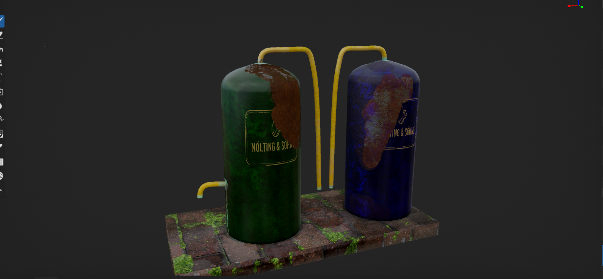
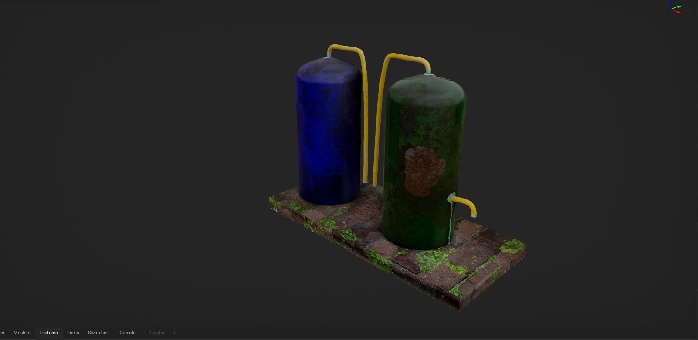
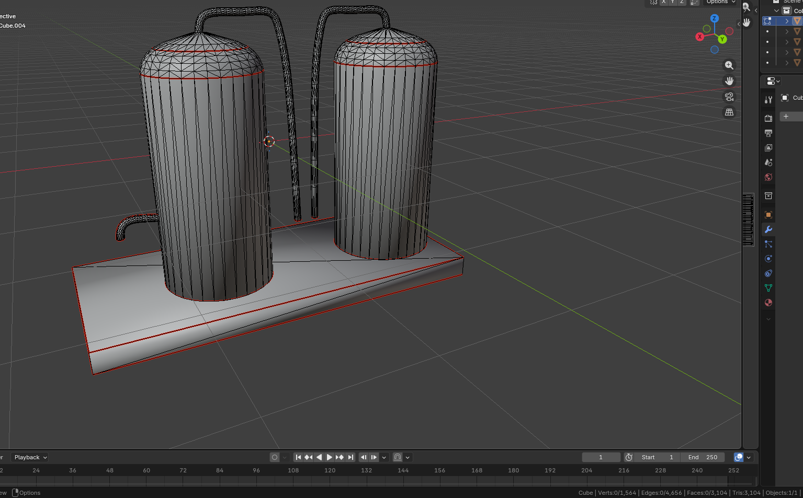
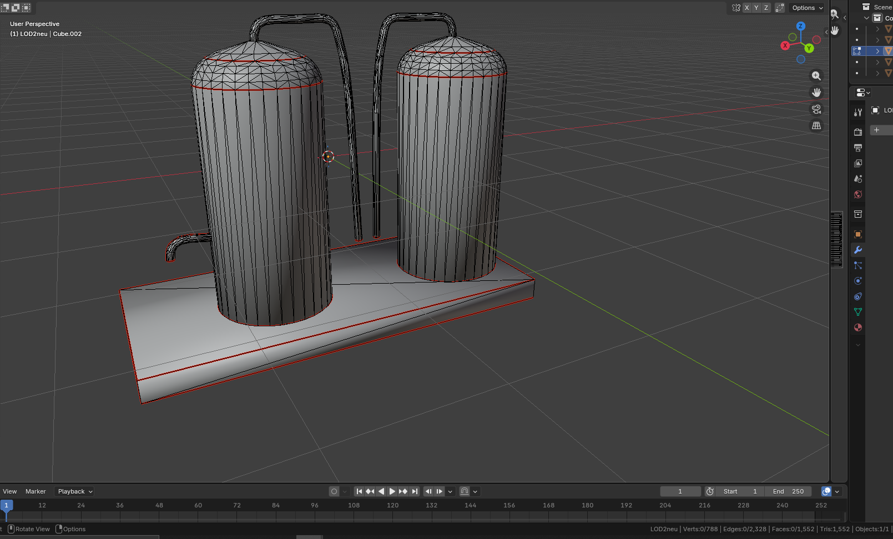
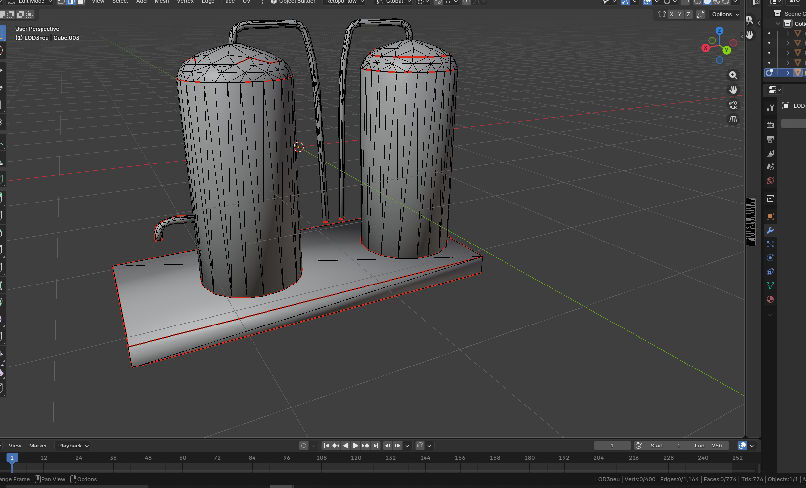

# Shadows Overhaul - DayZ Mod

An overhaul mod for DayZ focusing on immersion, technical optimization, and unique gameplay mechanics. The core centerpiece of this mod is a custom-designed bio-fuel refinery system and an upgrade Module for vehicles to run on the custom Fuel.

## 🚀 Key Features
* **Custom 3D Environment Assets:** Fully custom-modeled bio-fuel refinery buildings and machinery, highly optimized for the Enforce-Engine.
* **Asset Optimization:** Low-poly meshes, separate LOD Models with baked high-poly details to ensure maximum server and client performance (high FPS, low memory footprint).
* **Config & Script Integration:** Full integration into the DayZ Workbench ecosystem using clean object-oriented configuration structures.

## 🛠️ Tech Stack & Tools
* **3D Modeling & Texturing:** Blender (Mesh Creation and Optimization, UV Unwrapping), ArmorPaint (PBR Texturing)
* **Game Engine Pipeline:** VS Code, DayZ Workbench, Object Builder, P3D Format Execution
* **Configuration:** The config-example.json is the default generated Config file by this Mod and allows to de-/activate every Module for maximum customisation

## 📦 Repository Structure
* This Repository is directly structured as required by the Addon Builder to allow it to be packed successfully in an encrypted .pbo file

## 📄 License
This project is licensed under the Creative Commons Attribution-NonCommercial-ShareAlike 4.0 International License (CC BY-NC-SA 4.0). See the `LICENSE.md` file for details.

## Screenshots
# Armorpaint Textured Mesh

# LOD 1

# LOD 2

# LOD 3

